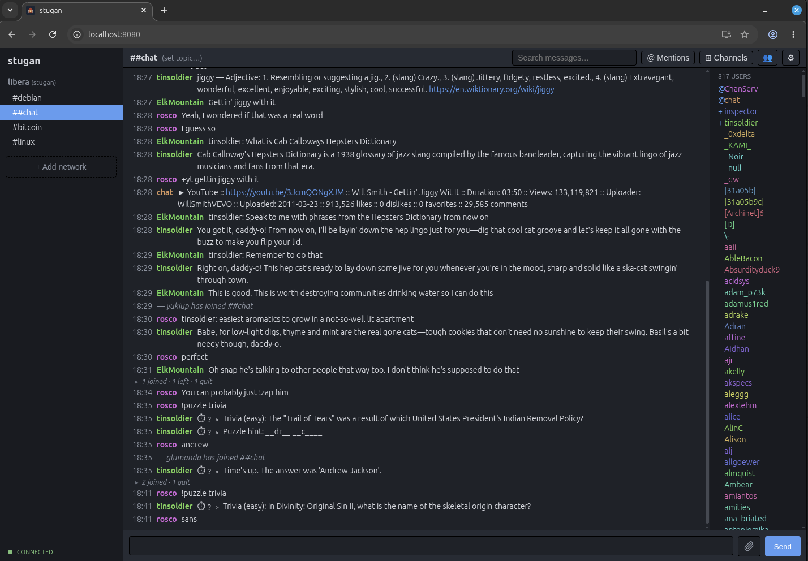

# stugan

A self-hosted, plugin-extensible web IRC client written in Go.

stugan is a persistent daemon that holds your IRC connections 24/7 and buffers
history, plus a Vue 3 browser frontend that talks to it over a typed-JSON
WebSocket — think [TheLounge](https://thelounge.chat/), rewritten in Go, with
the IRCv3 discipline of [Halloy](https://github.com/squidowl/halloy) and a
**weechat/irssi-style Lua plugin system** as the headline feature.



## Features

- Persistent connections that survive browser disconnects; SQLite history with
  backlog replay and full-text search (FTS5).
- Manage networks entirely from the web UI — add, edit, connect/disconnect,
  remove. Server password (bouncers like ZNC/soju), per-network "perform"
  commands, SASL (PLAIN and EXTERNAL/CertFP).
- IRCv3: server-time, echo-message, away-notify, account-tag, multi-prefix,
  extended-join, message-tags, typing indicators, standard-replies, emoji
  reactions, message redaction, a channel browser (LIST), best-effort
  chathistory. See [docs/ircv3.md](docs/ircv3.md).
- Link previews + inline image/video via a local proxy, drag-drop/paste
  uploads, autocomplete (nicks/commands/channels/emoji), command aliases,
  per-channel mute, a mentions view, configurable highlight rules.
- A **Lua plugin system** (weechat/irssi style): commands, message
  filters/rewrites, signal hooks, timers, persistent KV, hot-reload.
- PWA: installable, mobile-responsive, Web Push + desktop notifications.
- Multi-user with bcrypt auth and full per-user isolation; an optional
  site-wide password gate.

## Quick start

```sh
# Build the client (the daemon serves client/dist at /).
cd client && npm install && npm run build && cd ..

# Build and run the daemon.
go build -o stugan ./cmd/stugan
./stugan                      # uses $STUGAN_HOME, else ~/.config/stugan
./stugan -home ./dev          # disposable config/data dir
```

Then open the listen address (default `http://127.0.0.1:8080`).

For live client reload, run the daemon and the Vite dev server side by side
(Vite on :5173 proxies the WebSocket to the daemon on :8080):

```sh
./stugan &
cd client && npm run dev
```

## Docker

Images are published to GHCR (`ghcr.io/klppl/stugan`) for amd64 and arm64:

```sh
docker run -d --name stugan -p 8080:8080 -v stugan-data:/data \
  ghcr.io/klppl/stugan:latest
```

Config, history, scripts, and uploads live in the `/data` volume. Put a
`config.toml` there with `listen = "0.0.0.0:8080"`; set `public_url` /
`origin_patterns` when serving from a non-localhost host. See
[docs/docker.md](docs/docker.md) for the full run guide (compose, reverse
proxy + TLS, `trusted_proxies` for login throttling, auth, updates). The image is built and published by
`.github/workflows/docker.yml`.

## Configuration

Config, scripts, and data live under one root, resolved in order:
`$STUGAN_HOME`, then `$XDG_CONFIG_HOME/stugan`, then `~/.config/stugan`. By
default stugan runs single-user and unauthenticated; add `[[users]]` to require
login and isolate accounts. See [docs/config.md](docs/config.md) for the full
reference and [docs/config.example.toml](docs/config.example.toml) for a
starting point.

## Plugins

Drop a Lua script in `$STUGAN_HOME/scripts/*.lua` and it loads live
(hot-reloaded on save). Scripts register commands, filter/rewrite/drop
messages, hook signals, and run timers via a `stugan.*` API. A crashing script
is isolated and never takes down the daemon.

```lua
-- scripts/greet.lua
stugan.hook_command("greet", function(args, ctx)
  stugan.message(ctx.network, args[1], "hello from a plugin!")
end)
```

See [docs/plugins.md](docs/plugins.md) and [docs/examples](docs/examples)
(`greet`, `highlight_reply`, `away`, `sed`, `urls`, `expand`, `watch`,
`nickserv`, `qauth`, `fun`, plus the bundled FiSH encryption and `ignore`
plugins).

## Documentation

| Doc | What it covers |
|-----|----------------|
| [architecture](docs/layout.md) | Module/interface layout, dependency contract, data flow |
| [core](docs/core.md) | The engine, domain types, event bus, sinks, the plugin API surface |
| [protocol](docs/protocol.md) | The WebSocket wire protocol (envelope + every event) |
| [irc](docs/irc.md) | The IRC layer: girc wrapping, event translation, SASL |
| [ircv3](docs/ircv3.md) | IRCv3 capability matrix and roadmap |
| [storage](docs/storage.md) | SQLite schema, history, search, persistence |
| [server](docs/server.md) | HTTP/WebSocket server, multi-tenant hub, auth, security |
| [frontend](docs/frontend.md) | The Vue 3 client architecture |
| [theming](docs/theming.md) | Creating and installing custom themes |
| [docker](docs/docker.md) | Pulling the GHCR image and running it on a server |
| [plugins](docs/plugins.md) | The Lua plugin API |
| [config](docs/config.md) | Configuration reference |

## License

stugan is released under the [Lagom License](LICENSE) — not too much, not too
little.
</content>
</invoke>
