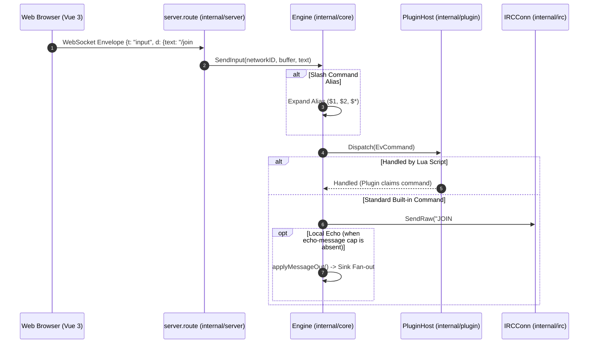

# Concurrency & Event Model

`stugan` coordinates all state transitions and client communications through a **two-sided event bus** driven by a single serial engine loop goroutine per tenant.

## The Two-Sided Bus

```mermaid
sequenceDiagram
    autonumber
    participant IRC as IRC Connection (internal/irc)
    participant Bus as Inbound Event Queue (chan Event)
    participant Loop as Engine Loop (internal/core)
    participant Plugin as PluginHost (internal/plugin)
    participant State as Domain State (e.mu)
    participant Sinks as Sinks (Store, Server, TUI)

    Note over IRC,Bus: Inbound Write Side
    IRC->>Bus: HandleEvent(ev)
    Bus->>Loop: Dequeue event
    Loop->>Plugin: Dispatch(ctx, ev)
    alt Hook drops message
        Plugin-->>Loop: keep=false
    else Hook mutates or accepts
        Plugin-->>Loop: mutatedEv, keep=true
        Loop->>State: applyLocked(mutatedEv)
        Note over Loop,Sinks: Outbound Read Side (Fan-Out)
        par Fan-Out to Sinks
            Loop->>Sinks: store.Print(m) / Persist
            Loop->>Sinks: server.userSink.Print(m) -> WS Frame
            Loop->>Sinks: tui.Print(m) -> Terminal
        end
    end
```

## Inbound Flow (IRC to Clients)

1. **Translation**: `internal/irc` receives a raw IRC line from `girc` and passes it through pure function `toEvent()` to produce a normalized `core.Event`.
2. **Enqueue**: The connection goroutine calls `Engine.HandleEvent()`, which non-blockingly places the event onto a 256-deep channel.
3. **Plugin Dispatch**: The single `Engine.Run` loop goroutine pops the event and passes it to `PluginHost.Dispatch()`. Registered Lua hooks run synchronously in priority order. Hooks may:
   - **Drop** the event (e.g. spam filters, ignore rules).
   - **Mutate** the text/tags (e.g. typography rewrites, decryption via `fish.lua`).
   - **Pass** through unmodified.
4. **State Mutation**: The engine acquires `e.mu.Lock()` and applies the mutated event to the in-memory domain tree (updating channel members, topics, connection status, or unread tallies).
5. **Sink Fan-Out**: Once committed, the engine broadcasts the resulting `core.Message` or structural event synchronously to all registered `core.Sink` implementations:
   - **`store.Store`**: Persists message to SQLite database and updates FTS5 index.
   - **`server.userSink`**: Serializes frame into JSON wire protocol `{t: "msg", d: ...}` and pushes to active client WebSockets.
   - **`tui.Server`**: Updates active terminal views for SSH users.
   - **`logSink`**: Writes structured output to terminal stdout when debug logging is active.

## Outbound Flow (Client to IRC)



## Concurrency Invariants

- **Single Writer**: In-memory domain structures are mutated *exclusively* on the engine loop goroutine.
- **Locking Discipline**: `e.mu` is an `RWMutex`. Writes only take place on the loop goroutine under `e.mu.Lock()`. External callers (such as WebSocket snapshot handlers) acquire `e.mu.RLock()` and receive deep-copied snapshots.
- **Non-blocking Sinks**: All `Sink` implementations must be non-blocking. Sinks must either enqueue onto dedicated worker queues (e.g., SQLite write loop or WebSocket client write buffers) or return immediately.

## Related Concepts

- [Core Domain & Interfaces](core.md)
- [Storage Engine (`internal/store`)](../subsystems/internal_store.md)
- [Server & WebSocket (`internal/server`)](../subsystems/internal_server.md)
