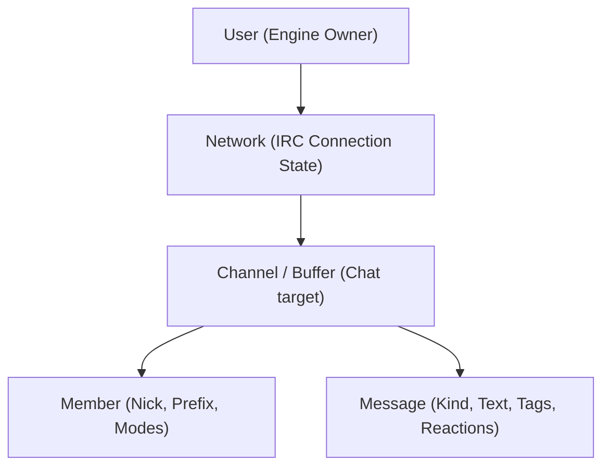

# Core Domain & Interfaces (`internal/core`)

`internal/core` represents the GUI- and transport-independent brain of `stugan`. It manages in-memory domain state, coordinates the event lifecycle, and defines the abstract contracts required to connect to external systems.

## Primary Interface Contracts

### 1. `IRCConn`
Defines core's abstraction of a network connection. Concrete implementation resides in `internal/irc`.

```go
type IRCConn interface {
    Connect(ctx context.Context) error
    SendRaw(line string) error
    Message(target, text string) error
    Caps() []string
    CurrentNick() string
    Autojoin()
    Close() error
}
```

### 2. `ConnHandler`
Implemented by `core.Engine`. Inbound connections invoke `HandleEvent` on the read loop to push normalized events into the core event queue.

```go
type ConnHandler interface {
    HandleEvent(ev Event)
}
```

### 3. `PluginHost`
Implemented by `internal/plugin`. Enables pre-commit hook execution, slash command registration, tab completions, and settings management.

```go
type PluginHost interface {
    Dispatch(ctx context.Context, ev Event) (out Event, keep bool)
    Commands() []string
    Complete(word, network, buffer string) []string
    Plugins() []PluginInfo
    CuratedPlugins() []CuratedPluginInfo
    LoadPlugin(name string) error
    UnloadPlugin(name string) error
    UninstallPlugin(name string) error
    ReloadPlugin(name string) error
    DownloadPlugin(ctx context.Context, name string) error
    ImportPlugin(ctx context.Context, rawURL, name string) error
    UpdatePlugin(ctx context.Context, name string) error
    CheckPluginUpdates(ctx context.Context, name string) error
    SetPluginSetting(script, key, value string) error
    Close() error
}
```

### 4. `Sink` (The Read Side of the Bus)
Enables observation of committed state changes. Handlers are called synchronously from the engine loop and must not block.

```go
type Sink interface {
    Print(m Message)
    NetworkChanged(n *Network)
    NetworkRemoved(networkID string)
    NetworksReordered(networkIDs []string)
    ChannelList(network string, items []ChannelListItem)
    Typing(network, buffer, nick, state string)
    React(network, buffer, target, nick, reaction string)
    Redact(network, buffer, target, nick, reason string)
}
```

## Domain Model Hierarchy

Domain entities are organized hierarchically:



- **`User`**: Root domain owner representing an authenticated user account.
- **`Network`**: Connection metadata, server address, SASL settings, nicknames, channels, and connection lifecycle status.
- **`Channel`**: Channel buffers or direct query buffers. Tracks topic, member lists, unread counters, and channel modes.
- **`Member`**: Nickname, user prefix modes (`@`, `+`, etc.), away status, and account tags.
- **`Message`**: Normalized message record including `Kind` (`MsgPrivmsg`, `MsgNotice`, `MsgAction`, `MsgSystem`), source nickname, timestamp, tags (IRCv3 message-tags / msgid), and reactions.

## Safe State Access & Deep Copying

State mutations are serialized through the engine loop under `e.mu` (`sync.RWMutex`). To ensure thread-safe concurrent reads from HTTP handlers, WebSocket writers, and TUI renderers without lock contention:

- **`Engine.Snapshot()`**: Returns a deep copy of all configured networks and channels.
- **`Engine.SnapshotNetwork(id)`**: Returns an isolated deep copy of a specific network.
- **Live pointers never escape the mutex lock**.

## Related Concepts

- [Architecture Overview](overview.md)
- [Concurrency & Event Model](concurrency_event_model.md)
- [IRC Subsystem (`internal/irc`)](../subsystems/internal_irc.md)
- [Plugin Runtime (`internal/plugin`)](../subsystems/internal_plugin.md)
