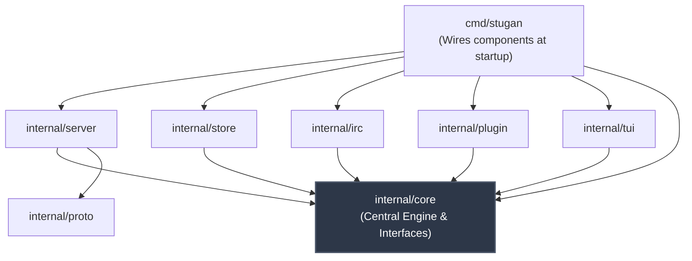

# Architecture Overview

`stugan` is engineered with Halloy-style architectural discipline: a **core that is completely agnostic of IRC libraries, transport protocols, database engines, or user interfaces**. All external subsystems integrate with the central core strictly through abstract Go interfaces.

## Unidirectional Dependency Rule

The core architectural invariant is that `internal/core` imports no concrete libraries (such as `girc`, `gopher-lua`, `modernc/sqlite`, `coder/websocket`, or Charm `wish`/`bubbletea`). Instead:
1. `internal/core` defines interfaces (`IRCConn`, `PluginHost`, `NetworkStore`, `Sink`, `Connector`, `API`).
2. Concrete subsystem packages (`internal/irc`, `internal/store`, `internal/plugin`, `internal/server`, `internal/tui`) implement these interfaces and depend on `internal/core`.
3. `cmd/stugan` serves as the composition root, instantiating concrete components and wiring them into `core.Engine`.

## Package Import Boundaries

| Package | Allowed Imports | Forbidden Imports |
| :--- | :--- | :--- |
| `internal/core` | `internal/proto` (types), stdlib | `server`, `irc`, `store`, `plugin`, `tui`, girc, Lua, UI libs |
| `internal/irc` | `girc`, `internal/core`, stdlib | `server`, `plugin`, `store`, `tui` |
| `internal/store` | `modernc.org/sqlite`, `internal/core`, stdlib | `server`, `plugin`, `irc`, `tui` |
| `internal/plugin` | `github.com/yuin/gopher-lua`, `internal/core`, stdlib | `server`, `irc` impl, `store` impl, `tui` |
| `internal/server` | `internal/core`, `internal/proto`, `internal/auth`, `coder/websocket`, stdlib | `girc`, Lua, `internal/tui` |
| `internal/tui` | `internal/core`, `wish`, `bubbletea`, `lipgloss`, stdlib | `girc`, Lua, `server`, `store` impl |
| `internal/proto` | stdlib only | All other internal packages |
| `internal/config`| `go-toml/v2`, stdlib | All other internal packages |

## Architectural Benefits

- **Swappability**: Replacing the IRC client engine (e.g. migrating from `girc` to a custom IRCv3 parser) requires changing only `internal/irc`.
- **Alternative Plugin Runtimes**: Introducing a WASM or JavaScript plugin engine requires only a new `core.PluginHost` implementation.
- **Multiple Simultaneous Consumers**: The WebSocket server (`internal/server`) and the SSH Terminal UI (`internal/tui`) operate as independent, concurrent `core.Sink` consumers of the same `core.Engine`.
- **Testability**: The core engine can be comprehensively unit tested using mock or in-memory sinks and connectors without spinning up real network sockets or database files.

## Related Concepts

- [Core Abstraction (`internal/core`)](core.md)
- [Concurrency & Event Model](concurrency_event_model.md)
- [Application Entry (`cmd/stugan`)](../subsystems/cmd_stugan.md)
