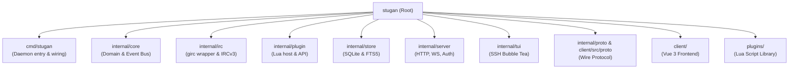

# Stugan Quickstart & Overview

`stugan` is a self-hosted, plugin-extensible web IRC client written in Go with a Vue 3 frontend and an SSH Terminal UI. It operates as a persistent daemon that holds IRC connections 24/7, buffers history in an embedded SQLite database, and serves a modern responsive browser client over a typed JSON WebSocket protocol.

## Key Features

- **Persistent Connections**: Daemon maintains connections 24/7 across browser reconnects.
- **SQLite History & FTS5**: Full history buffering, message search, and backlog replay.
- **Strict Architecture**: `internal/core` has zero concrete library dependencies (no girc, no SQLite, no Lua, no WebSocket lib).
- **Lua Plugin System**: Weechat/irssi-inspired Lua scripting with hooks for messages, commands, timers, signals, and persistent KV storage.
- **IRCv3 Support**: `server-time`, `echo-message`, `away-notify`, `account-tag`, `typing`, `message-tags`, `draft/chathistory`, and standard replies.
- **Multi-Tenant Hub**: Multi-user isolation with bcrypt authentication, session cookies, and per-user databases.
- **SSH Terminal Interface**: Direct SSH access to persistent sessions via Charm's Wish and Bubble Tea.
- **Vue 3 Web Client**: Pinia state management, virtualized message lists, link previews, inline media proxy, and custom theming.

## Repository Navigation Map



## Documentation Guide

- [Architecture Overview](architecture/overview.md) — System boundaries, dependency direction, and design principles.
- [Core Abstraction (`internal/core`)](architecture/core.md) — Core domain types, interfaces (`IRCConn`, `PluginHost`, `Sink`), and dependency inversion.
- [Concurrency & Event Model](architecture/concurrency_event_model.md) — Serial engine loop, hook dispatch, state mutations, and Sink fan-out.
- [Application Entry (`cmd/stugan`)](subsystems/cmd_stugan.md) — Flag parsing, multi-tenant hub construction, and context lifecycle.
- [IRC Subsystem (`internal/irc`)](subsystems/internal_irc.md) — Connection management, SASL, capability negotiation, and line translation.
- [Plugin Runtime (`internal/plugin`)](subsystems/internal_plugin.md) — Lua worker goroutine, sandboxed `stugan.*` API, timeouts, and KV store.
- [Storage Engine (`internal/store`)](subsystems/internal_store.md) — SQLite schema, WAL mode, FTS5 full-text search, and unread tracking.
- [Server & Hub (`internal/server`)](subsystems/internal_server.md) — WebSocket routing, HTTP static serving, bcrypt auth, and reverse proxy support.
- [SSH Terminal UI (`internal/tui`)](subsystems/internal_tui.md) — Wish SSH server, Bubble Tea TUI, and keybindings.
- [Wire Protocol (`internal/proto`)](subsystems/internal_proto_client_proto.md) — Typed JSON envelope `{t, id, d}` and TypeScript schema synchronization.
- [Vue 3 Client (`client/`)](subsystems/client.md) — Frontend architecture, Pinia stores, virtualized list, and PWA integration.
- [Plugin Library (`plugins/`)](subsystems/plugins.md) — Ready-to-use Lua plugins (`ai.lua`, `webhooks.lua`, `fish.lua`, `away.lua`, etc.).

## Quick Commands

### Building and Running the Backend

```bash
# Build daemon binary
go build -o stugan ./cmd/stugan

# Run with custom home directory
./stugan -home ./dev

# Generate bcrypt hash for configuration
printf 'mypassword\n' | ./stugan -hashpw
```

### Building the Frontend

```bash
cd client
npm install
npm run build     # Typechecks and builds to client/dist
npm run dev       # Runs Vite dev server on :5173 with proxy to :8080
```
