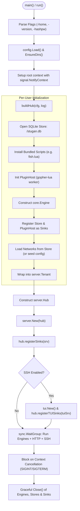

# Subsystem: `cmd/stugan`

`cmd/stugan` serves as the composition root of the application. It parses command-line flags, loads configuration, resolves file system roots, constructs per-user tenants and the shared `server.Hub`, registers `Sink` implementations, and manages graceful daemon lifecycle shutdown.

## Key Source Files

- **[`main.go`](file:///Users/alex/GitHub/stugan/cmd/stugan/main.go)**: Flag parsing (`-home`, `-version`, `-hashpw`), signal handling (`SIGINT`, `SIGTERM`), and root goroutine coordination.
- **[`hub.go`](file:///Users/alex/GitHub/stugan/cmd/stugan/hub.go)**: Multi-user tenant constructor (`buildHub`), history retention pruner, and sink registration bridges.
- **[`connector.go`](file:///Users/alex/GitHub/stugan/cmd/stugan/connector.go)**: Implements `core.Connector` by wrapping `internal/irc.New` to maintain interface separation.
- **[`ssh.go`](file:///Users/alex/GitHub/stugan/cmd/stugan/ssh.go)**: Resolves SSH public keys against user configurations for terminal access.

## Startup & Wiring Lifecycle

## CLI Flags

| Flag | Type | Description |
| :--- | :--- | :--- |
| `-home` | `string` | Sets config, data, and scripts root (overrides `$STUGAN_HOME`). |
| `-version` | `bool` | Prints the version string and exits immediately. |
| `-hashpw` | `bool` | Reads a password from `stdin` and outputs a bcrypt hash for `config.toml`. |

## Graceful Teardown Contract

All subsystems share a root `context.Context`. When `SIGINT` or `SIGTERM` is intercepted:
1. The root context is canceled, triggering concurrent cancellation of all IRC connections, HTTP listeners, and SSH sessions.
2. The `defer cleanup()` callback runs sequentially across all user tenants.
3. Each tenant executes:
   - `Engine.Close()` (flushing in-flight events).
   - `PluginHost.Close()` (tearing down Lua states and file watchers).
   - `Store.Close()` (checkpointing SQLite WAL and closing database handles).

## Related Concepts

- [Architecture Overview](../architecture/overview.md)
- [Server & Hub (`internal/server`)](internal_server.md)
- [Storage Engine (`internal/store`)](internal_store.md)
