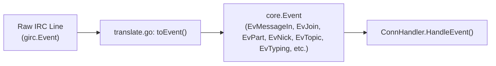

# Subsystem: `internal/irc`

`internal/irc` implements the `core.IRCConn` interface. It encapsulates all IRC protocol mechanics, socket management, TLS negotiation, SASL authentication, and IRCv3 capability handling using [`github.com/lrstanley/girc`](https://github.com/lrstanley/girc).

## Architectural Boundary

`internal/irc` is the **only place in the entire repository where `girc` is imported**. All interactions between `internal/irc` and the rest of the application occur via the abstract `core.IRCConn` and `core.ConnHandler` interfaces.

## Key Source Files

- **[`conn.go`](file:///Users/alex/GitHub/stugan/internal/irc/conn.go)**: Implements `core.IRCConn` over `girc.Client`, managing connection lifecycle, autojoin logic, ping timers, and reconnect backoff.
- **[`translate.go`](file:///Users/alex/GitHub/stugan/internal/irc/translate.go)**: Pure conversion functions that map raw `girc.Event` objects into normalized `core.Event` records.
- **[`sasl.go`](file:///Users/alex/GitHub/stugan/internal/irc/sasl.go)**: SASL authentication implementations, including `PLAIN` and `EXTERNAL` (CertFP client certificates).

## Supported IRCv3 Capabilities

`internal/irc` requests and handles the following IRCv3 capabilities:

| Capability | Behavior / Handling |
| :--- | :--- |
| `server-time` | Normalizes server timestamps into `core.Message.Time`. |
| `echo-message` | Displays server-acknowledged outbound messages; suppresses local echo in `core.Engine`. Delivered via `ALL_EVENTS` handler. |
| `account-tag` | Extracts authenticated NickServ/Services account name onto `core.Member` and `core.Message`. |
| `away-notify` | Live updates to user away states (`AWAY` events) without active WHO polling. |
| `multi-prefix` | Receives all status prefixes (e.g. `@+` for op and voice) in `NAMES` replies. |
| `extended-join` | Captures account name and realname directly upon channel join events. |
| `message-tags` | Parses structured metadata including `msgid`, reactions, and client tags. |
| `+typing` (`TAGMSG`) | Translates client typing notifications (`active`, `paused`, `done`) into ephemeral `core.Sink.Typing` events. |
| `draft/chathistory` | Queries server-side backlog buffers where supported. |

## Raw Line Translation (`toEvent`)

Inbound events pass through `toEvent()` in [`translate.go`](file:///Users/alex/GitHub/stugan/internal/irc/translate.go).

### Echo-Message Gotcha
`girc` routes standard messages to command-specific handlers, but routes `echo-message` events **only to the `ALL_EVENTS` handler** when `e.Echo == true`. `internal/irc` attaches a dedicated handler to intercept echoed lines, translating them into `EvMessageIn` with `Self = true`.

## Related Concepts

- [Core Domain & Interfaces](../architecture/core.md)
- [Concurrency & Event Model](../architecture/concurrency_event_model.md)
- [Wire Protocol (`internal/proto`)](internal_proto_client_proto.md)
