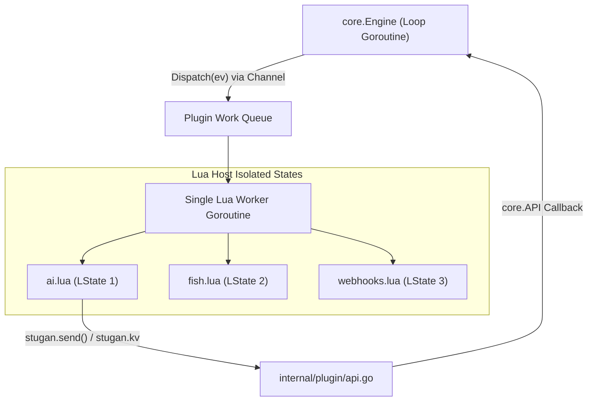

# Subsystem: `internal/plugin`

`internal/plugin` implements `core.PluginHost` using [`github.com/yuin/gopher-lua`](https://github.com/yuin/gopher-lua). It provides a WeeChat/Irssi-style Lua scripting environment that executes custom slash commands, transforms inbound/outbound messages, reacts to network signals, runs background timers, and persists script state in SQLite key-value stores.

## Threading & Safety Model

- **Dedicated Worker Goroutine**: All Lua states (`*lua.LState`) run on a single dedicated work-queue goroutine. Lua execution never blocks the main engine loop or network handlers.
- **State Isolation**: Each script runs in its own isolated `*lua.LState`. Scripts communicate only through the shared `stugan.*` Go API bridge.
- **Timeouts & Failure Circuit Breaker**: Hooks run with configurable per-call execution deadlines. If a script raises repeated runtime errors, it is automatically marked `Disabled = true` so a buggy script can never crash the daemon or stall the message loop.
- **Hot-Reloading via fsnotify**: Script files placed in `$STUGAN_HOME/scripts/*.lua` are dynamically loaded, reloaded on change, or unloaded on deletion without dropping active IRC connections.

## The `stugan.*` Lua API Surface

Lua scripts are exposed to the `stugan` namespace:

| Lua Function | Description |
| :--- | :--- |
| `stugan.describe({ name = "...", description = "..." })` | Declares script metadata and documentation shown in the Web UI. |
| `stugan.hook_message(priority, function(ev) ... end)` | Intercepts inbound chat messages. Returning modified text rewrites it; returning `nil` drops it. |
| `stugan.hook_command("cmd", "help text", function(args) ... end)` | Registers custom slash command (e.g. `/ask`, `/summarize`). |
| `stugan.hook_timer(interval_ms, function() ... end)` | Registers a periodic background timer. |
| `stugan.hook_signal(signal_name, function(data) ... end)` | Listens for system signals (`connected`, `disconnected`, `highlight`). |
| `stugan.hook_completion(function(word, network, buffer) ... end)` | Provides dynamic tab completions to the frontend. |
| `stugan.setting(name, { type = "...", default = "..." })` | Exposes configurable settings displayed in the Web UI Settings view. |
| `stugan.send(network, buffer, text)` | Sends a message directly to IRC without local echo recursion. |
| `stugan.kv.get(key)` / `stugan.kv.set(key, val)` | Read and write persistent script key-value pairs stored in SQLite. |
| `stugan.http_get(url, headers)` / `stugan.http_post(...)` | Performs non-blocking HTTP requests. |

## Official Plugin Library Integration

The plugin runtime supports downloading, loading, and updating official scripts from the curated catalog located in [`plugins/`](file:///Users/alex/GitHub/stugan/plugins):
- `/load <script-name>`: Downloads and loads a script into runtime.
- `/unload <script-name>`: Unloads and disables a script.
- `/reload <script-name>`: Re-reads script from disk and re-executes.

## Related Concepts

- [Core Domain & Interfaces](../architecture/core.md)
- [Plugin Library Catalog](plugins.md)
- [Storage Engine (`internal/store`)](internal_store.md)
