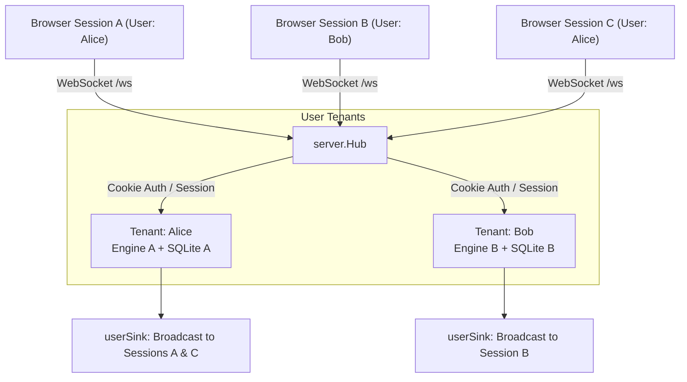

# Subsystem: `internal/server`

`internal/server` implements the HTTP web server and real-time WebSocket communication layer using [`github.com/coder/websocket`](https://github.com/coder/websocket). It bridges frontend browser sessions to their respective backend `core.Engine` instances.

## Multi-Tenant Hub Architecture

The server supports both single-user and multi-user configurations via `server.Hub`.

## Security & Authentication Features

- **Bcrypt Password Auth**: Users authenticate via `/api/login`, receiving secure `HttpOnly`, `SameSite=Lax` session cookies.
- **Optional Magic Word Gate (`$STUGAN_WEB_PASSWORD`)**: Configurable site-wide password gate required before accessing login forms or static assets.
- **Login Rate Limiting**: Exponential login throttling keyed by client IP.
- **Reverse Proxy Trust (`trusted_proxies`)**: Safely resolves real client IPs from `X-Forwarded-For` / `X-Real-IP` only when requests originate from configured CIDR proxy ranges.
- **File Upload & Inline Media Proxy**:
  - Secure drag-and-drop file upload endpoint (`/api/upload`) storing files in `<data>/uploads` or forwarding to external hosts.
  - Media preview proxy (`/api/media`) verifying URL schemes and content types with strict size limits to protect client privacy.
- **Web Push Notifications**: Web Push subscriptions (`/api/push`) and VAPID key distribution.

## WebSocket Wire Protocol Handler (`route.go`)

Incoming WebSocket frames are decoded as `{t: string, id: string, d: any}`:
1. Validates envelope structure and authenticates connection session.
2. Dispatches payload to target engine method (`SendInput`, `AddNetworkLive`, `EditNetworkLive`, `RemoveNetworkLive`, `SendReaction`, `RedactMessage`, `MarkRead`, `Search`).
3. Sends synchronous acknowledgment or asynchronous reply frames carrying matching request `id`.

## Related Concepts

- [Subsystem: `cmd/stugan`](cmd_stugan.md)
- [Wire Protocol (`internal/proto`)](internal_proto_client_proto.md)
- [Vue 3 Frontend (`client/`)](client.md)
