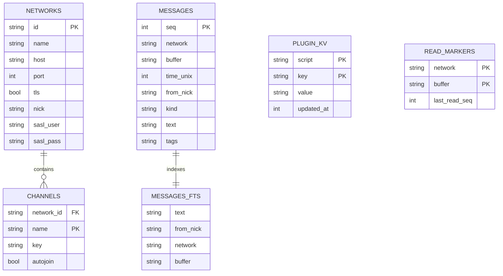

# Subsystem: `internal/store`

`internal/store` implements persistent history storage, network configurations, and script key-value data using pure Go embedded SQLite ([`modernc.org/sqlite`](https://modernc.org/sqlite)).

## Per-User Database Isolation

In multi-user mode, each user tenant receives an independent SQLite database located at:
- Single-user / default: `$STUGAN_HOME/stugan.db`
- Multi-user tenant: `$STUGAN_HOME/users/<username>/stugan.db`

Databases operate with Write-Ahead Logging (`PRAGMA journal_mode = WAL`) and busy timeouts for high-concurrency read/write operations.

## Database Schema & Core Tables

### Schema Responsibilities

1. **`messages` & `messages_fts`**:
   - `messages`: Append-only log of committed chat lines.
   - `messages_fts`: SQLite FTS5 virtual table synchronized via SQLite triggers for instant full-text search across all channels and networks.
2. **`networks` & `channels`**:
   - Persists network and channel state configured via the Web UI. The database is the authoritative source of truth across restarts (TOML `[[networks]]` only seed on the first startup).
3. **`plugin_kv`**:
   - Backs `stugan.kv.get()` / `stugan.kv.set()` and script settings configured via the UI.
4. **`read_markers`**:
   - Persists the latest read sequence per buffer, enabling calculation of accurate unread badges on browser reload.

## Backlog Replay & Search Queries

- **Backlog Replay (`Backlog`)**: Fetches messages with sequence numbers strictly before `beforeSeq` with configurable pagination limits for smooth infinite scrolling in the Vue client.
- **FTS5 Search (`Search`)**: Performs BM25-ranked full-text queries across message history, filtering by network, buffer, sender, and time range.
- **History Pruning**: `hub.pruneHistoryLoop` periodically removes messages older than `history.retention_days` and optimizes the database.

## Related Concepts

- [Core Domain & Interfaces](../architecture/core.md)
- [Concurrency & Event Model](../architecture/concurrency_event_model.md)
- [Server & Hub (`internal/server`)](internal_server.md)
