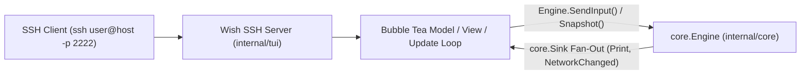

# Subsystem: `internal/tui`

`internal/tui` implements an embedded SSH server and interactive full-screen Terminal User Interface (TUI) powered by Charm's [Wish](https://github.com/charmbracelet/wish), [Bubble Tea](https://github.com/charmbracelet/bubbletea), and [Lip Gloss](https://github.com/charmbracelet/lipgloss).

## Architecture & Integration

`internal/tui.Server` operates as an independent `core.Sink` alongside `internal/server`. SSH clients connect directly to the daemon's SSH port (default `:2222`), authenticate via public keys (`authorized_keys`), and interact with their persistent `core.Engine` session without requiring a web browser.

## Features & Controls

- **Full-Screen Terminal View**: Multi-pane layout showing network sidebar, message backlog buffer, member list, and input line.
- **Mouse & Keyboard Support**: Full mouse scroll and click support, terminal resizing, and URL clicking.
- **Quick-Switcher (`Ctrl+K`)**: Fast fuzzy finder to jump between channels, private queries, and networks.
- **Keyboard Shortcuts**:
  - `Alt + Up/Down` or `Alt + [ / ]`: Switch active buffer.
  - `Alt + 1..9`: Jump directly to buffer by index.
  - `PageUp / PageDown`: Scroll message backlog history.
  - `Tab`: Auto-complete nicknames, commands, and channel names.
  - `Ctrl + L`: Redraw and clear screen.
- **Plugin Management**: Inspect active plugins and toggle settings directly within the terminal UI.

## Related Concepts

- [Architecture Overview](../architecture/overview.md)
- [Core Domain & Interfaces](../architecture/core.md)
- [Composition Root (`cmd/stugan`)](cmd_stugan.md)
